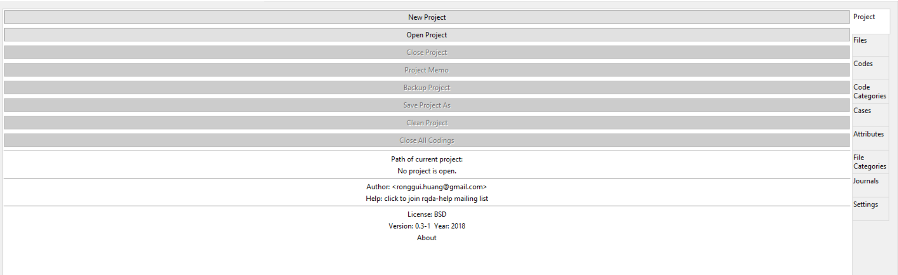

---
beamer_presentation:
  colortheme: crane
author: "Mary Angelica Painter"
date: "March 17, 2020"
output:
  beamer_presentation: default
fig_height: 5
fig_width: 5
fonttheme: structurebold
fig_caption: no
slidy_presentation: default
theme: Singapore
title: "Qualitative Research in R"
---
```{r setup, include=FALSE}
knitr::opts_chunk$set(echo = FALSE)
```

## What is Qualitative Research?

- Collects and works with non-numerical data (*think* descriptive)

  - Interviews
  
  - Open-Ended Surveys
  
  - Visual and Textual Content
  
  - Can also include observations, immersion, ethnography, oral histories, etc.
  

## What is Qualitative Research?

- Helps to find meaning that informs action, behavior, and interactions

- Usually "micro" level (*think* small scale like community research)

- Usually less generalizable, but add context to existing research or corroborate findings


## Qualitative vs Quantitative

- Quantitative is

  - Numeric
  
  - Usually large in scale
  
  - Uses statistics
  
  - Determines causal/correlative relationships
  
- Qualitative is

  - Non-numeric
  
  - "Micro"
  
  - Uses descriptive tools
  
  - Describes relationships
  
## Qualitative Methods and Tools

Luckily for us, we can use R to help us with either large or small sets of qualitative data. Today we will look at two methods:


  - Text Coding (usually interviews)
  
    - *RQDA*

  - Text Mining and Sentiment Analysis
  
    - *tidytext*
    
    - *tm*


## Installing RQDA

1. Like every package, you need to have R installed (I recommend you have RStudio as well)

2. Next, you install RQDA

- install.packages("RQDA", dependencies = TRUE)
  
- It is important that you install the dependencies!
  
3. Read in RQDA

- library(RQDA)
  
- It will prompt you to "Install GKT+". Be sure you install this because it is a GUI application and requires it for the interface.

4. Your RQDA window should pop up!

## RQDA



